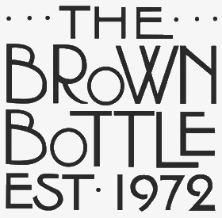
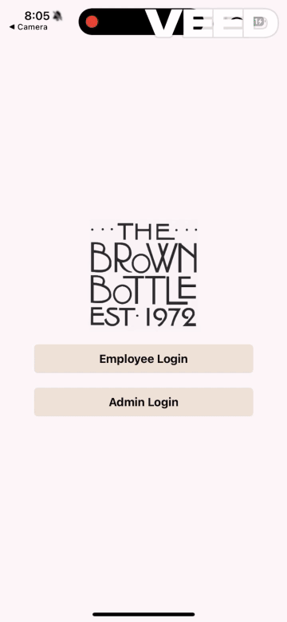
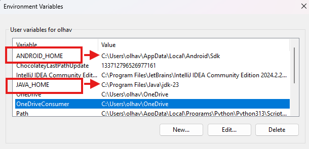
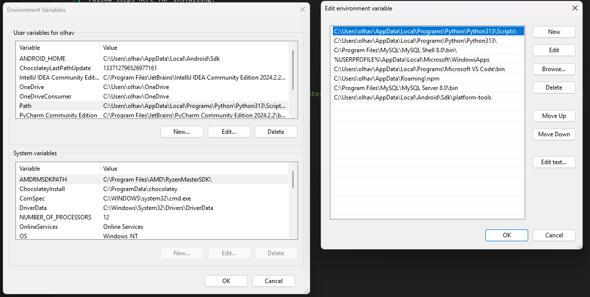
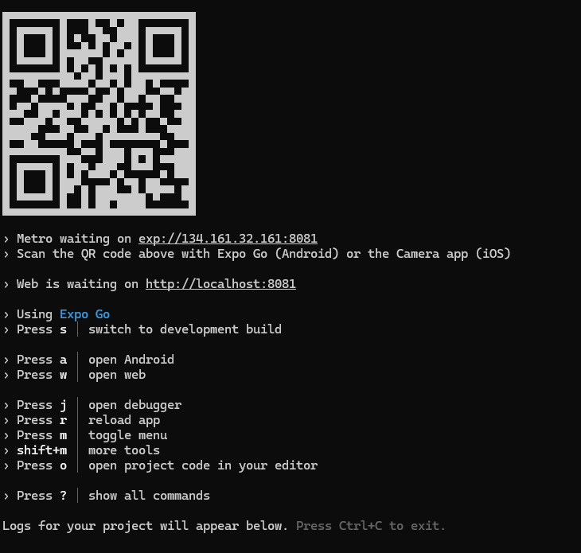
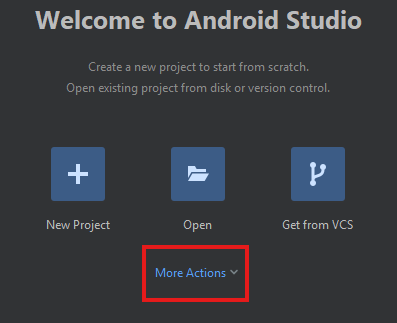
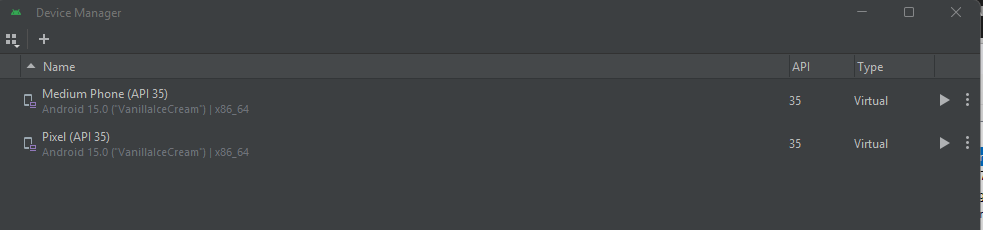

# thebrownbottle
<div align="center">
    
</div>


### CS4800 Research 
#### Student Researchers: Dominick Olhava, Ishimwe Gentil, Aaryn Warrior
#### Faculty Advisor: Dr. Andrew Berns


## Project Description
Our group of student researchers are developing a mobile application that is accessible on Android and IOS to facilitate scheduling, time off requests, business chat rooms, logging takeout orders, potentially keeping track of stock, and other business necessities per request for a local Cedar Falls restaurant called The Brown Bottle. This business currently has very little electronic management systems and everything is done with pencil and paper. Within this application there will be both a standard and administrative user for certain app functionalities. 

Bi-Weekly interviews are conducted with the restaurant team in order to create user stories and fulfill their wishes and vision for the app.  

We will be utilizing the **React-Native** tech stack with **Expo Go** to develop the frontend as well as MySQL and Python to create a backend. The project will include aspects of all computer science disciplines taught at UNI. Frontend development will involve software engineering with best coding practices. Backend development will involve database systems and networking to communicate with the frontend. 

This project will implement **Agile** programming cycles periodically to keep development on track. Discord will be used for team communication. GitHub will be the primary platform to use for version control. Figjam will be used to log team tasks and document code changes. Figma will be used for designing the user interface. Microsoft VS Code will be the IDE of choice. For a team based work environment we have decided to meet weekly on Tuesdays and Thursdays to plan, research, and build the project.

The Brown Bottle App should be released in **Fall of 2025** for commercial use!

### Beta Home Screen Design
<div align="center">
    
</div>


## Installing React Native 

### Initial Dependencies
Follow steps [HERE](https://reactnative.dev/docs/set-up-your-environment) for installing:
1. Node.js
2. JDK
3. Android Studio
4. System ENV Variables and PATH

### Windows ENV and PATH Configuration
**NOTE:** Your Java version may be different but that is okay!
<div align="center">
    <p>Update ENV Variables to <b>ANDROID_HOME and JAVA_HOME</b></p>
    
    <p>Add PATH: <b>C:\Users\<usernmame>\AppData\Local\Android\Sdk\platform-tools</b></p>
    
</div>


## Start Fresh
1. Uninstall current **cli** programs.
    ```bash
    npm uninstall -g react-native-cli
    npm uninstall -g expo-cli
    react-native --version  # Should give an error if not installed globally
    expo --version          # Should give an error if not installed globally
    ```

2. Update **npm** to latest version globally.
    ```bash
    npm install -g npm@latest
    ```

3. Install the **expo cli** globally.
    ```bash
    npm install -g expo-cli
    ```


## Start the React Native App with **Expo Go**
1. Clone thebrownbottle repository.

2. Start the **Expo Go** application for the first time.
    - Navigate to the app-directory -> Ex: brown-bottle-app
        ```bash
        cd <app-directory>
        ```      

    - Run the following **npm** command to install required dependencies
        ```bash
        npm install
        ```

    - Run the following **npx** command to start the app **after initial clone** (Clears build cache so existing app routes can be properly created)  
        ```bash
        npm run fresh
        ```

        **OR**

        ```bash
        npx expo start --clear
        ```

3. Start the app **AFTER** first start.
    ```bash
    npm start
    ```

<div align="center">
    
</div>

### Other Commands
Start the App in **Tunnel** Mode (Useful when the dev computer and mobile device are on different networks)
```bash 
npm run tunnel
```

Create a **NEW** Expo Go Project
```bash
npx create-expo-app <app-name> # Creates a new React Native Project in a folder within the current directory
```


## Android Studio AVD Setup (Optional)
**NOTE**: You only need to set up the AVD once and then Expo Go will handle the rest!
<div align="center">
    <p>Open the dropdown and select <b>Virtual Device Manager</b></p>
    
    <p>Add a new AVD with the <b>+</b> or press the <b>triangle</b> to run an existing emulation</p>
    
</div>


## Docker 
IMPORTANT: Have the **.env file** in the same directory as docker-compose.yaml file. Also, do **NOT** have a local instance of MySQL running on your development device!

### Container Startup
1. Start in the backend directory.  
**HINT:** You should be able to list the files and see docker-compose.yaml

2. Make sure docker daemon service is running! (Open docker desktop or start the service from the command line)

### Container Commands  

Build Containers  
**NOTE:** Use when you change source code for backend containers!
```bash
docker compose up --build
```

Start Containers
```bash
docker compose up # Runs in foreground

docker compose up -d # Runs in background
```

Connect to MySQL Container Instance
```bash
mysql -h 127.0.0.1 -P 3306 -u <username> -p
```

**OR** 

Connect to Container Shell
```bash
docker exec -it <container-name> /bin/sh
```

Login to MySQL through Container Shell
```bash
mysql -u <mysql_username> -p
```

### Container Names
- MySQL = **bb-db**
- Backend Python Server = **bb-api**


## Project Resources

Access preliminary UI design images [HERE](./ui_designs/)

### Project Colors
Light Tan - #F0E7E0  
Dark Tan - #ECE1D4  
Yellowish Tan - #FFDEAB  
Brown - #7C580D  
Greyish White (App Background) - #FBF7F7  
Bright White - #FBF7F7  

